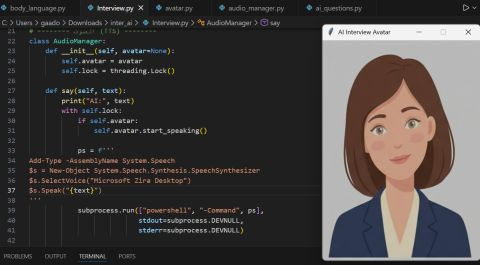

# AI Interview Body Language Analysis 🤖

An AI-powered virtual interview system that analyzes speech and body language in real-time.

## 🚀 Overview
This system simulates a virtual interview where the user interacts with an AI.

It evaluates:
- Speech responses
- Head movement
- Hand movement
- Stress indicators

## 🎯 Features
- Real-time interview interaction
- Speech recognition
- AI-generated questions
- Body language analysis using computer vision
- Performance feedback

## 🛠 Tools & Technologies
- Python
- OpenCV
- MediaPipe
- Vosk (Speech Recognition)
- Text-to-Speech (TTS)
- Tkinter (UI)

## 📸 Screenshots

### Interface

